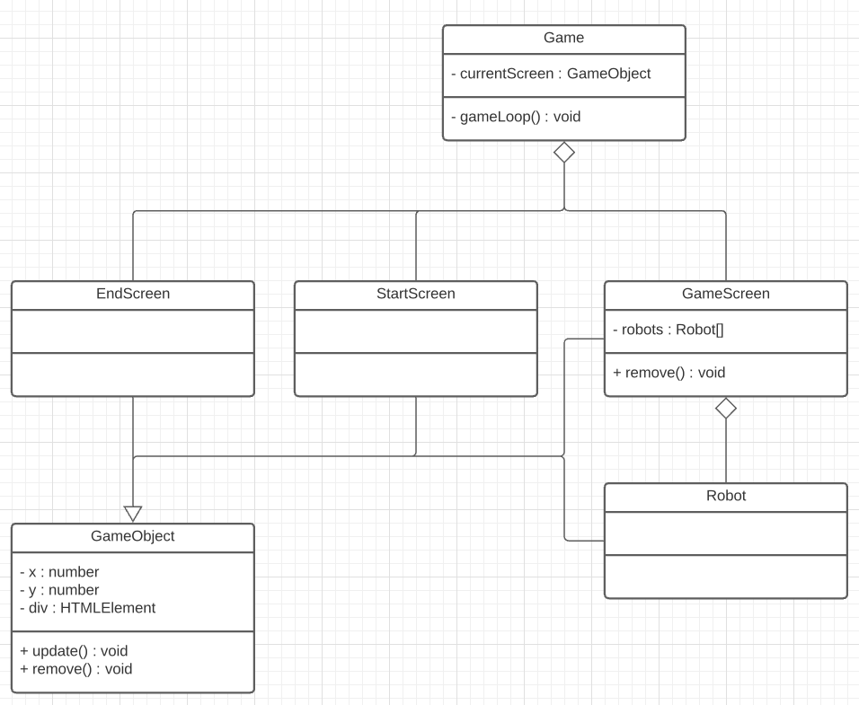

# CMTTHE04-1 Week 7 - Werken met Classes

- Een Class maken voor de speech API
- Wisselen tussen schermen

<br>
<br>

## Een Class maken voor de speech API

De [Speech API](https://github.com/HR-CMGT/PRG08-2020-2021/blob/main/snippets/speech.md) heeft een eigenschap `synth` en een function `speak`, dit leent zich perfect om een `class` van te maken.

<br>
<br>

## Wisselen tussen schermen

We gebruiken **composition** om te kunnen wisselen tussen schermen. Elk scherm krijgt een eigen Class waarin game elementen geplaatst worden. Vanuit `game.ts` wordt alleen nog maar de `update` van het huidige scherm aangeroepen.



Het is belangrijk dat al deze classes een update en remove functie hebben.

<br>

## Switch screen

Game.ts krijgt een property om te onthouden wat het huidige scherm is. De `switchScreen` functie verwijdert het vorige scherm en plaatst dan een nieuw scherm.

```typescript
export class Game {

    private currentScreen:GameObject

    constructor(){
        this.currentScreen = new Startscreen(this)
        this.gameLoop()
    }

    private gameLoop(){
        this.currentScreen.update()
        requestAnimationFrame(()=>this.gameLoop())
    }

    public switchScreen(screen:GameObject) {
        this.currentScreen.remove()
        this.currentScreen = screen
    }
}
```

<br>

## Switch sreen aanroepen vanuit een andere class

Om `switchSreen` aan te kunnen roepen vanuit het startscherm, moet het startscherm eerst een verwijzing naar de game krijgen.

```typescript
export class Startscreen extends GameObject {
    private game:Game
    constructor(g:Game) {
        super("startscreen")
        this.game = g
    }
}
```
Vervolgens kan je van scherm wisselen door een `new Gamescreen` scherm aan te maken en dat aan de game te geven!

```typescript
let newScreen = new Gamescreen(game)
this.game.switchScreen(newScreen)
```

<br>

## DOM Objecten verwijderen

Om zeker te weten dat alle DOM elementen verwijderd worden moet elk scherm een `remove` functie hebben. In gamescreen wordt dit gebruikt om alle robots te verwijderen. Roep ook `super.remove()` aan om de gamescreen div te verwijderen.

```typescript
public remove() {
    for (let o of this.robots) {
        o.remove()
    }
    super.remove()
}
```